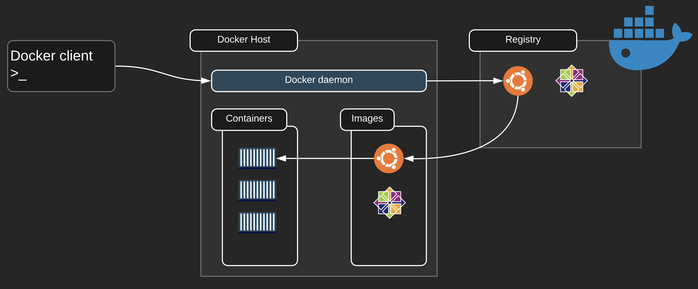

# Docker Architechture

## Architecture Overview
Docker architecture:
- Client-server architecture: Client and server are seperate binaries, the docker client can be used to communicate with different daemons
- Client talks to the Docker daemon
- The Docker daemon handles heavy things
  - Building
  - Running
  - Distributing
- Both communicate using a REST API, this can be done using
  - UNIX sockets
  - Network interface

The Docker daemon (dockerd):
- Listens for Docker API requests and manages Docker objects:
  - Images
  - Containers
  - Networks
  - Volumes

The Docker client (docker):
- Is how users interact with Docker
- Sends commands to dockerd

Docker registries (similar Github repository)
- Stores Docker images
- Public registry such as DockerHub (by default docker using dockerhub)
- Let you run your own private registry

Docker objects:
- Images:
  - Read-only template with instructions for creating a Docker container
  - Image is based on another image
  - Create your own images
  - Use images published to a registry
  - Use a Dockerfile to build images
- Containers:
  - Runnable instance of an image
  - Connect a container to networks
  - Attach storage
  - Create a new image based on its current state
  - Isolated from other containers and the host machine
- Services:
  - Scale containers across multiple Docker daemons (Multiple hosts)
  - Docker Swarm (Manager: manage cluster, worker: executing tasks)
  - Define the desired state (if you have 3 replicas and one of them has an issue and dies off, the service will go and create new replacement replica and bring you back up to that desired state
  - Service is load-balanced

Docker Swarm:
- Multiple Docker daemons (Master and Workers) working together
- The daemons all communicate using the Docker API
- Supported in Docker 1.12 and higher